# App Dependency Graph

> Auto-generated by `packages/dep-graph`. Run `npm run dep-graph` to regenerate.
>
> To add a new dependency rule, edit `packages/dep-graph/src/rules.ts`.
> Solid edges = required · Dashed edges = optional (app works without it).

```mermaid
graph TD
  subgraph automation
    n8n
    openclaw
  end

  subgraph backup
    backrest
    syncthing
  end

  subgraph development
    code-server
    http-https-echo
  end

  subgraph media
    bazarr
    fileflows
    flaresolverr
    jellyfin
    plex
    prowlarr
    qbittorrent
    radarr
    recyclarr
    seerr
    sonarr
    tautulli
    threadfin
  end

  subgraph monitoring
    grafana-backup
    prometheus-operator
    scraparr
  end

  subgraph network
    adguardhome
  end

  subgraph system
    argocd
    cert-manager
    infisical-operator
    local-path-provisioner
    longhorn
    metallb
    rancher
    reloader
    traefik
  end

  adguardhome -->|LoadBalancer IP| metallb
  argocd -->|LoadBalancer IP| metallb
  argocd -. Ingress .-> traefik
  bazarr -. Ingress .-> traefik
  code-server -. Ingress .-> traefik
  fileflows -. Ingress .-> traefik
  grafana-backup -->|InfisicalSecret| infisical-operator
  http-https-echo -. Ingress .-> traefik
  jellyfin -. Ingress .-> traefik
  longhorn -->|InfisicalSecret| infisical-operator
  longhorn -->|LoadBalancer IP| metallb
  metallb -->|ServiceMonitor / PodMonitor| prometheus-operator
  n8n -. Ingress .-> traefik
  openclaw -->|InfisicalSecret| infisical-operator
  plex -->|LoadBalancer IP| metallb
  plex -. Ingress .-> traefik
  prometheus-operator -->|InfisicalSecret| infisical-operator
  prometheus-operator -->|StorageClass| longhorn
  prometheus-operator -. Ingress .-> traefik
  prowlarr -. Ingress .-> traefik
  qbittorrent -. Ingress .-> traefik
  radarr -. Ingress .-> traefik
  recyclarr -->|InfisicalSecret| infisical-operator
  reloader -->|ServiceMonitor / PodMonitor| prometheus-operator
  scraparr -->|InfisicalSecret| infisical-operator
  seerr -. Ingress .-> traefik
  sonarr -. Ingress .-> traefik
  syncthing -. Ingress .-> traefik
  tautulli -. Ingress .-> traefik
  traefik -->|InfisicalSecret| infisical-operator
  traefik -->|LoadBalancer IP| metallb
  traefik -->|ServiceMonitor / PodMonitor| prometheus-operator
```

## Required dependencies

| App                   | Depends on            | Reason                      |
| --------------------- | --------------------- | --------------------------- |
| `adguardhome`         | `metallb`             | LoadBalancer IP             |
| `argocd`              | `metallb`             | LoadBalancer IP             |
| `grafana-backup`      | `infisical-operator`  | InfisicalSecret             |
| `longhorn`            | `infisical-operator`  | InfisicalSecret             |
| `longhorn`            | `metallb`             | LoadBalancer IP             |
| `metallb`             | `prometheus-operator` | ServiceMonitor / PodMonitor |
| `openclaw`            | `infisical-operator`  | InfisicalSecret             |
| `plex`                | `metallb`             | LoadBalancer IP             |
| `prometheus-operator` | `infisical-operator`  | InfisicalSecret             |
| `prometheus-operator` | `longhorn`            | StorageClass                |
| `recyclarr`           | `infisical-operator`  | InfisicalSecret             |
| `reloader`            | `prometheus-operator` | ServiceMonitor / PodMonitor |
| `scraparr`            | `infisical-operator`  | InfisicalSecret             |
| `traefik`             | `infisical-operator`  | InfisicalSecret             |
| `traefik`             | `metallb`             | LoadBalancer IP             |
| `traefik`             | `prometheus-operator` | ServiceMonitor / PodMonitor |

## Optional dependencies

| App                   | Depends on | Reason  |
| --------------------- | ---------- | ------- |
| `argocd`              | `traefik`  | Ingress |
| `bazarr`              | `traefik`  | Ingress |
| `code-server`         | `traefik`  | Ingress |
| `fileflows`           | `traefik`  | Ingress |
| `http-https-echo`     | `traefik`  | Ingress |
| `jellyfin`            | `traefik`  | Ingress |
| `n8n`                 | `traefik`  | Ingress |
| `plex`                | `traefik`  | Ingress |
| `prometheus-operator` | `traefik`  | Ingress |
| `prowlarr`            | `traefik`  | Ingress |
| `qbittorrent`         | `traefik`  | Ingress |
| `radarr`              | `traefik`  | Ingress |
| `seerr`               | `traefik`  | Ingress |
| `sonarr`              | `traefik`  | Ingress |
| `syncthing`           | `traefik`  | Ingress |
| `tautulli`            | `traefik`  | Ingress |
